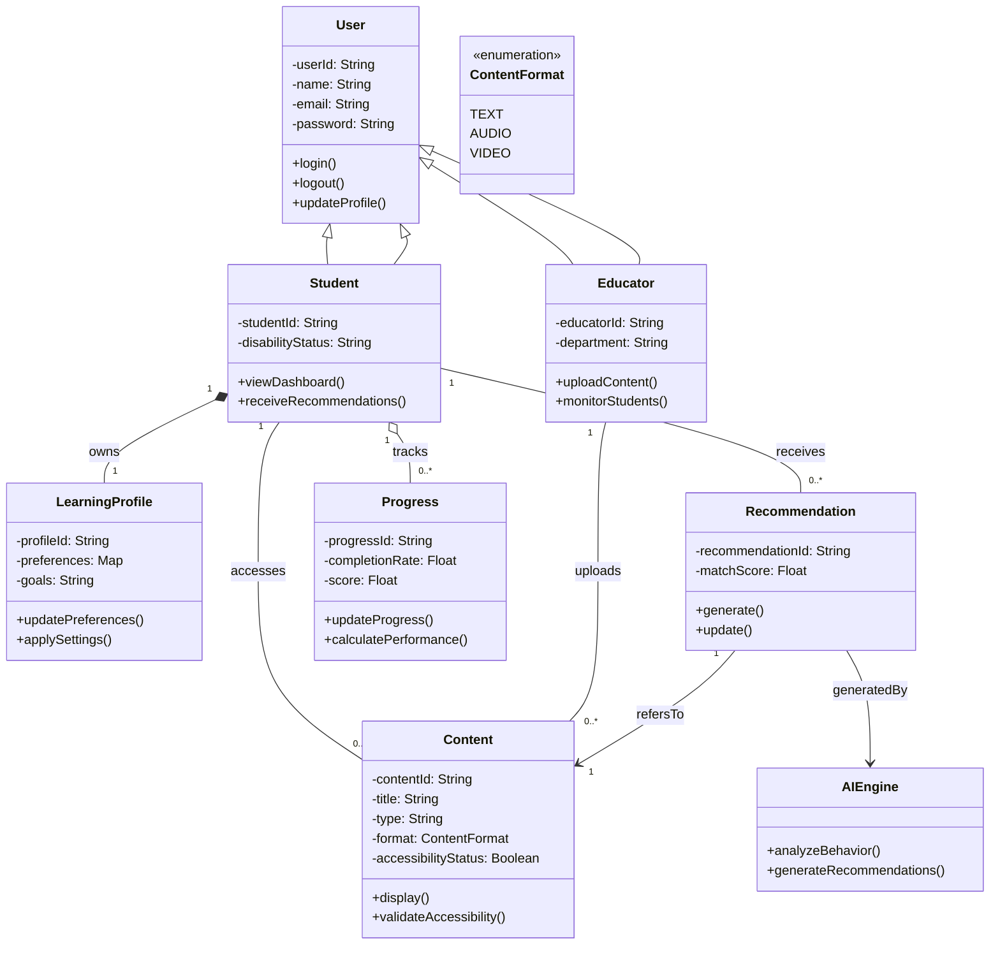

# Class Diagram - AI Adaptive Learning System

## Design Explanation

The class diagram models the structure of the AI Adaptive Learning System using object-oriented principles.

**Inheritance** is used to distinguish between Student and Educator roles from the base User class.
**Associations** represent interactions between entities, such as students accessing content and receiving recommendations.
Multiplicity ensures realistic constraints (e.g., one student can have many recommendations).
The LearningProfile is tightly linked to the student to support personalization.
The Recommendation class connects AI logic with learning content.

### Composition vs Aggregation
- **LearningProfile is composition** --> cannot exist without Student  
- **Progress is aggregation** --> can exist independently as historical data  

### AI Engine Abstraction
The AIEngine class separates machine learning logic from core system logic.  
This ensures:
- Scalability
- Maintainability
- Independent model updates

### Enumeration Usage
ContentFormat enum ensures:
- Type safety
- Controlled content types
- Cleaner validation

### Design Principle Applied
- Single Responsibility Principle (SRP)
- Open/Closed Principle (OCP)
- Separation of Concerns

This design ensures scalability, maintainability, and alignment with system requirements.

### visual representation
 